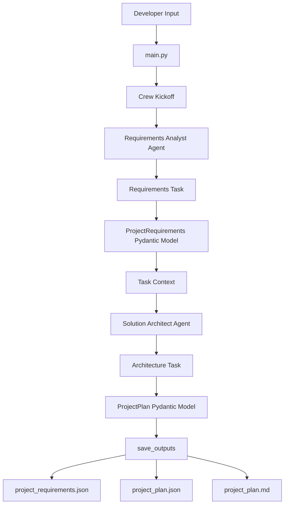

# AI Project Planner

> A schema-driven multi-agent CrewAI application that converts a rough AI engineering idea into validated product requirements, a practical system architecture, an implementation roadmap, testing guidance, GitHub deliverables, and a résumé-ready project description.

---

## Table of Contents

1. [Project Overview](#project-overview)
2. [Problem Statement](#problem-statement)
3. [What the Application Produces](#what-the-application-produces)
4. [Core Concepts Demonstrated](#core-concepts-demonstrated)
5. [Technology Stack](#technology-stack)
6. [System Architecture](#system-architecture)
7. [End-to-End Workflow](#end-to-end-workflow)
8. [CrewAI Building Blocks](#crewai-building-blocks)
9. [Pydantic Schema Design](#pydantic-schema-design)
10. [Project Structure](#project-structure)
11. [File-by-File Explanation](#file-by-file-explanation)
12. [Installation](#installation)
13. [Environment Configuration](#environment-configuration)
14. [Running the Project](#running-the-project)
15. [Generated Outputs](#generated-outputs)
16. [Testing](#testing)
17. [How to Customize the Project](#how-to-customize-the-project)
18. [Error Handling and Validation](#error-handling-and-validation)
19. [Common Errors and Troubleshooting](#common-errors-and-troubleshooting)
20. [Security Practices](#security-practices)
21. [Current Limitations](#current-limitations)
22. [Future Improvements](#future-improvements)
23. [Portfolio and Interview Value](#portfolio-and-interview-value)
24. [GitHub Publishing Guide](#github-publishing-guide)
25. [Learning Outcomes](#learning-outcomes)

---

## Project Overview

`AI Project Planner` is a simple but complete multi-agent AI engineering project built with CrewAI.

The system accepts three main inputs:

- a rough AI project idea;
- the developer's current technical skills;
- the available implementation time.

It then uses two specialized AI agents:

1. **AI Product Requirements Analyst**
2. **Senior AI Solution Architect**

The first agent determines **what should be built**.

The second agent determines **how it should be built**.

The agents communicate through validated Pydantic data models instead of uncontrolled free-form text.

The final application saves:

```text
output/project_requirements.json
output/project_plan.json
output/project_plan.md
```

This project demonstrates that a multi-agent application is not merely several prompts. It is a coordinated software workflow with:

- specialized responsibilities;
- controlled execution order;
- typed data contracts;
- configuration management;
- validation;
- output persistence;
- testing;
- packaging;
- reproducible setup.

---

## Problem Statement

Many developers have AI project ideas such as:

```text
Build an AI assistant for predictive maintenance.
```

However, the idea is often too vague to implement directly.

Important questions remain unanswered:

- Who are the users?
- What exact problem does the application solve?
- Which features are essential?
- What data is required?
- Which technologies should be used?
- How should components communicate?
- What should be built first?
- How should the project be tested?
- What should be included in the GitHub repository?
- How can the work be described on a résumé?

This project converts an unclear idea into a structured and buildable engineering plan.

---

## What the Application Produces

The workflow creates two major structured outputs.

### 1. Project Requirements

The first agent creates a `ProjectRequirements` object containing:

- professional project title;
- problem statement;
- target users;
- prioritized core features;
- data inputs;
- constraints;
- measurable success metrics.

Example:

```json
{
  "project_title": "Pneumatic Maintenance Copilot",
  "problem_statement": "Maintenance engineers need faster access to grounded fault-diagnosis information.",
  "target_users": [
    "Maintenance engineers",
    "Plant technicians"
  ],
  "core_features": [
    {
      "name": "Document ingestion",
      "description": "Process equipment manuals for semantic retrieval.",
      "priority": "must_have",
      "reason": "The assistant requires grounded technical evidence."
    }
  ],
  "data_inputs": [
    "Equipment manuals",
    "Sensor alerts",
    "Maintenance history"
  ],
  "constraints": [
    "One-developer implementation",
    "Four-week delivery period"
  ],
  "success_metrics": [
    "Retrieval hit rate",
    "Answer faithfulness"
  ]
}
```

### 2. Project Plan

The second agent creates a `ProjectPlan` object containing:

- project summary;
- system architecture;
- component responsibilities;
- request flow;
- API endpoint recommendations;
- technology stack;
- implementation milestones;
- testing strategy;
- major risks;
- GitHub deliverables;
- résumé bullet.

---

## Core Concepts Demonstrated

This repository demonstrates several production-oriented AI engineering concepts.

### Multi-Agent Role Separation

Instead of asking one LLM to solve the entire problem, the application separates responsibilities:

```text
Requirements Analyst
        ↓
Defines what should be built
        ↓
Solution Architect
        ↓
Defines how it should be built
```

This mirrors real software and product teams.

### Sequential Agent Workflow

The crew uses:

```python
Process.sequential
```

The requirements task completes before the architecture task begins.

### Structured Agent Handoffs

The first agent does not pass only unstructured prose to the second agent.

It produces:

```python
ProjectRequirements
```

The second task receives that structured output as context.

### Schema-Driven Development

Pydantic models define the exact structure of acceptable outputs.

This improves:

- reliability;
- validation;
- downstream integration;
- testability;
- readability;
- JSON serialization.

### Configuration-Driven Agents and Tasks

Agent roles and task prompts are stored in YAML files rather than being hard-coded entirely inside Python.

This separates:

```text
Behavioral configuration
from
Application implementation
```

### Application-Level Output Handling

The final CrewAI result is validated, transformed, and written to JSON and Markdown files.

### Reusable LLM Configuration

The LLM configuration is created once and cached with:

```python
@lru_cache(maxsize=1)
```

### Environment-Based Secrets

The model name and API key are stored in `.env`, not inside source code.

### Automated Schema Tests

Pytest verifies that invalid data is rejected and valid structures are accepted.

---

## Technology Stack

### CrewAI

CrewAI provides the multi-agent orchestration layer.

It is used for:

- creating agents;
- defining tasks;
- assembling crews;
- configuring execution processes;
- passing context between tasks;
- generating structured outputs.

Main imports:

```python
from crewai import Agent, Crew, LLM, Process, Task
from crewai.project import CrewBase, agent, crew, task
```

### Pydantic

Pydantic provides typed schemas and runtime validation.

It is used for:

- agent output contracts;
- nested data models;
- required fields;
- list-length constraints;
- numeric limits;
- fixed allowed values;
- JSON serialization.

Main imports:

```python
from pydantic import BaseModel, Field, field_validator
```

### Python Dotenv

`python-dotenv` loads variables from `.env`.

```python
from dotenv import load_dotenv

load_dotenv()
```

This allows the application to access:

```text
MODEL
OPENAI_API_KEY
DEEPSEEK_API_KEY
```

without hard-coding secrets.

### YAML

YAML stores human-readable agent and task configuration.

Files:

```text
config/agents.yaml
config/tasks.yaml
```

### UV

`uv` manages:

- virtual environments;
- dependencies;
- package installation;
- command execution;
- lock-file generation.

### Hatchling

Hatchling is the Python build backend used by `pyproject.toml`.

```toml
[build-system]
requires = ["hatchling"]
build-backend = "hatchling.build"
```

### Pytest

Pytest tests the Pydantic schemas.

```text
tests/test_schemas.py
```

### JSON

JSON stores machine-readable outputs that can later be consumed by:

- FastAPI;
- Streamlit;
- React;
- databases;
- evaluation scripts;
- other agents.

### Markdown

Markdown produces a readable project report suitable for:

- GitHub;
- documentation;
- human review;
- portfolio presentation.

---

## System Architecture



### Logical Layer View

```text
Input Layer
    main.py / build_inputs()

Configuration Layer
    agents.yaml
    tasks.yaml
    .env

Orchestration Layer
    crew.py
    Agent
    Task
    Crew
    Process

Contract Layer
    schemas.py
    ProjectRequirements
    ProjectPlan

Output Layer
    JSON files
    Markdown report

Quality Layer
    pytest
    Pydantic validation
```

---

## End-to-End Workflow

### Step 1: Define Inputs

`main.py` creates the input dictionary:

```python
{
    "project_idea": "...",
    "current_skills": "...",
    "time_budget": "..."
}
```

### Step 2: Substitute YAML Placeholders

CrewAI inserts the values into placeholders such as:

```yaml
{project_idea}
{current_skills}
{time_budget}
```

### Step 3: Run the Requirements Analyst

The first agent reads the idea and produces a validated:

```python
ProjectRequirements
```

### Step 4: Pass Structured Context

The architecture task declares:

```python
context=[self.analyze_requirements()]
```

This makes the first task's output available to the second task.

### Step 5: Run the Solution Architect

The architect uses:

- structured requirements;
- the developer's current skills;
- the available time.

It returns:

```python
ProjectPlan
```

### Step 6: Validate Crew Outputs

`main.py` checks that:

```python
result.tasks_output[0].pydantic
```

is a `ProjectRequirements` object and:

```python
result.pydantic
```

is a `ProjectPlan` object.

### Step 7: Save Output Artifacts

The application writes:

```text
project_requirements.json
project_plan.json
project_plan.md
```

### Step 8: Print Token Usage

When available, CrewAI token usage is printed to the console.

This introduces basic cost and observability awareness.

---

## CrewAI Building Blocks

## Agent

An agent represents a specialized AI worker.

Example:

```python
@agent
def requirements_analyst(self) -> Agent:
    return Agent(
        config=self.agents_config["requirements_analyst"],
        llm=build_llm(),
        verbose=True,
        allow_delegation=False,
        max_iter=6,
    )
```

Important properties:

### `config`

Loads:

```yaml
role
goal
backstory
```

from `agents.yaml`.

### `llm`

Defines which language model powers the agent.

### `verbose=True`

Shows execution logs for learning and debugging.

### `allow_delegation=False`

Prevents an agent from assigning work to other agents.

This keeps the first version predictable.

### `max_iter`

Limits how many reasoning or execution iterations an agent may perform.

It helps prevent unnecessary loops and uncontrolled cost.

---

## Task

A task defines a specific assignment.

Example:

```python
@task
def analyze_requirements(self) -> Task:
    return Task(
        config=self.tasks_config["analyze_requirements"],
        output_pydantic=ProjectRequirements,
    )
```

The task configuration includes:

```yaml
description
expected_output
agent
```

### `description`

Explains what the agent must do.

### `expected_output`

Explains what a complete, high-quality result should contain.

### `output_pydantic`

Defines the exact structural contract.

The difference is important:

```text
Task prompt:
Controls meaning and quality

Pydantic schema:
Controls shape and data types
```

---

## Context

The second task includes:

```python
context=[self.analyze_requirements()]
```

This creates a producer-consumer relationship:

```text
Requirements task
    produces ProjectRequirements
        ↓
Architecture task
    consumes requirements
```

Without context, the architect would have to reanalyze the original idea independently and could produce inconsistent assumptions.

---

## Crew

The crew assembles agents and tasks.

```python
@crew
def crew(self) -> Crew:
    return Crew(
        agents=self.agents,
        tasks=self.tasks,
        process=Process.sequential,
        verbose=True,
    )
```

### `agents=self.agents`

Uses all methods decorated with `@agent`.

### `tasks=self.tasks`

Uses all methods decorated with `@task`.

### `process=Process.sequential`

Runs tasks in order.

### `verbose=True`

Displays crew-level execution information.

---

## CrewBase

```python
@CrewBase
class AIProjectPlannerCrew:
```

`@CrewBase` turns the class into a CrewAI project definition and connects:

- YAML configurations;
- agent methods;
- task methods;
- the final crew.

---

## LLM

The project builds a reusable CrewAI `LLM` object:

```python
@lru_cache(maxsize=1)
def build_llm() -> LLM:
    model_name = os.getenv("MODEL", "openai/gpt-4o-mini").strip()

    return LLM(
        model=model_name,
        temperature=0,
    )
```

### Why `temperature=0`?

The workflow is planning-oriented and should be consistent.

A low temperature generally favors:

- reproducibility;
- less creative variation;
- more stable structured output.

### Why `lru_cache`?

Without caching, repeated calls could create multiple equivalent LLM configuration objects.

Caching returns the same object after the first creation.

---

## Pydantic Schema Design

The project uses nested schemas.

### FeatureRequirement

```python
class FeatureRequirement(BaseModel):
    name: str
    description: str
    priority: Literal[
        "must_have",
        "should_have",
        "nice_to_have"
    ]
    reason: str
```

This is stronger than:

```python
features: list[str]
```

because every feature contains:

- a name;
- a detailed description;
- an implementation priority;
- a justification.

### ProjectRequirements

```python
class ProjectRequirements(BaseModel):
    project_title: str
    problem_statement: str
    target_users: list[str]
    core_features: list[FeatureRequirement]
    data_inputs: list[str]
    constraints: list[str]
    success_metrics: list[str]
```

Important validations include:

```python
core_features: list[FeatureRequirement] = Field(
    ...,
    min_length=3,
    max_length=6,
)
```

This prevents the agent from returning too few or too many core features.

### Field Validator

```python
@field_validator(
    "target_users",
    "data_inputs",
    "constraints",
    "success_metrics"
)
```

The validator:

- removes empty strings;
- strips unnecessary whitespace;
- removes duplicates while preserving order.

### ArchitectureComponent

```python
class ArchitectureComponent(BaseModel):
    name: str
    responsibility: str
    technology: str
    communicates_with: list[str]
```

This gives each component explicit engineering meaning.

### Milestone

```python
class Milestone(BaseModel):
    week: int = Field(..., ge=1, le=8)
    goal: str
    deliverables: list[str]
```

The week number must be between 1 and 8.

### ProjectPlan

The final model includes:

```python
class ProjectPlan(BaseModel):
    project_name: str
    summary: str
    architecture: list[ArchitectureComponent]
    request_flow: list[str]
    api_endpoints: list[str]
    technology_stack: list[str]
    milestones: list[Milestone]
    testing_strategy: list[str]
    risks: list[str]
    github_deliverables: list[str]
    resume_bullet: str
```

---

## Project Structure

```text
ai_project_planner/
├── .env.example
├── .gitignore
├── README.md
├── requirements.txt
├── pyproject.toml
├── output/
│   └── .gitkeep
├── src/
│   └── ai_project_planner/
│       ├── __init__.py
│       ├── crew.py
│       ├── main.py
│       ├── schemas.py
│       ├── config/
│       │   ├── agents.yaml
│       │   └── tasks.yaml
│       └── tools/
│           └── __init__.py
└── tests/
    └── test_schemas.py
```

---

## File-by-File Explanation

### `.env.example`

Provides a safe template for environment variables.

Example:

```env
MODEL=openai/gpt-4o-mini
OPENAI_API_KEY=replace_with_your_openai_api_key
```

Create `.env` from this template, but never commit the real `.env`.

---

### `.gitignore`

Prevents sensitive and generated files from entering Git.

Important exclusions:

```gitignore
.env
.venv/
__pycache__/
output/*
```

The file preserves:

```text
output/.gitkeep
```

so Git can track the otherwise empty output directory.

---

### `requirements.txt`

Provides a traditional pip-compatible dependency list.

```text
crewai
python-dotenv
pydantic
```

The main source of dependency metadata is still `pyproject.toml`.

---

### `pyproject.toml`

Defines:

- package metadata;
- Python version;
- dependencies;
- development dependencies;
- executable commands;
- build backend;
- CrewAI project type;
- pytest configuration.

The recommended scripts section is:

```toml
[project.scripts]
ai_project_planner = "ai_project_planner.main:run"
run_crew = "ai_project_planner.main:run"
```

`run_crew` is important because `crewai run` may attempt to execute that command.

---

### `agents.yaml`

Defines who the agents are.

```yaml
requirements_analyst:
solution_architect:
```

Each agent contains:

```yaml
role:
goal:
backstory:
```

The YAML keys must match the Python method names exactly.

Correct:

```yaml
requirements_analyst:
```

```python
def requirements_analyst(self):
```

---

### `tasks.yaml`

Defines what the agents must do.

```yaml
analyze_requirements:
design_project:
```

Each task includes:

```yaml
description:
expected_output:
agent:
```

The task keys should match the Python task method names.

---

### `schemas.py`

Defines the Pydantic contracts shared between CrewAI and the rest of the application.

This is the main reliability layer of the project.

---

### `crew.py`

Defines:

- LLM configuration;
- agents;
- tasks;
- task context;
- crew assembly;
- sequential execution.

---

### `main.py`

Acts as the application entry point.

Responsibilities:

- define inputs;
- start the crew;
- inspect outputs;
- validate returned models;
- generate Markdown;
- save JSON and Markdown files;
- print execution results.

---

### `tests/test_schemas.py`

Tests the data contracts independently of the LLM.

This is important because LLM testing and schema testing are different.

Schema tests answer:

```text
Does the application reject invalid data?
```

LLM evaluation answers:

```text
Is the generated content useful and correct?
```

---

## Installation

## Prerequisites

Install:

- Python 3.10, 3.11, 3.12, or 3.13;
- Git;
- `uv`;
- a supported LLM provider API key.

Check Python:

```powershell
python --version
```

Check Git:

```powershell
git --version
```

Check CrewAI:

```powershell
crewai --version
```

---

## Clone the Repository

```powershell
git clone YOUR_REPOSITORY_URL
cd ai_project_planner
```

---

## Install with CrewAI

```powershell
crewai install
```

---

## Install with UV

```powershell
uv sync
```

Install development dependencies:

```powershell
uv sync --extra dev
```

---

## Install with Pip

```powershell
python -m venv .venv
.\.venv\Scripts\Activate.ps1
pip install -r requirements.txt
pip install -e .
```

---

## Environment Configuration

Copy the template:

```powershell
Copy-Item .env.example .env
```

Open `.env`:

```powershell
notepad .env
```

Example OpenAI configuration:

```env
MODEL=openai/gpt-4o-mini
OPENAI_API_KEY=your_real_api_key
```

Example DeepSeek-style configuration:

```env
MODEL=deepseek/deepseek-chat
DEEPSEEK_API_KEY=your_real_api_key
```

The exact provider variables depend on the CrewAI provider configuration you use.

Do not add spaces around `=`:

```env
MODEL = openai/gpt-4o-mini
```

Avoid that form.

Use:

```env
MODEL=openai/gpt-4o-mini
```

---

## Running the Project

### Recommended CrewAI Command

First ensure `pyproject.toml` contains:

```toml
[project.scripts]
ai_project_planner = "ai_project_planner.main:run"
run_crew = "ai_project_planner.main:run"
```

Then synchronize:

```powershell
uv sync
```

Run:

```powershell
crewai run
```

### Run the Script Directly with UV

```powershell
uv run ai_project_planner
```

or:

```powershell
uv run run_crew
```

### Run Through Python Module Installation

After:

```powershell
pip install -e .
```

run:

```powershell
ai_project_planner
```

---

## Generated Outputs

After successful execution:

```text
output/
├── project_requirements.json
├── project_plan.json
└── project_plan.md
```

### `project_requirements.json`

Contains the first task's validated `ProjectRequirements`.

### `project_plan.json`

Contains the final validated `ProjectPlan`.

### `project_plan.md`

Contains a human-readable version of the final plan.

The Markdown conversion is handled by:

```python
build_markdown_report(plan)
```

---

## Testing

Install development dependencies:

```powershell
uv sync --extra dev
```

Run:

```powershell
uv run pytest
```

Expected tests include:

- valid requirements model acceptance;
- rejection of fewer than three core features;
- rejection of an invalid milestone week;
- acceptance of a complete project plan.

### Why Test Schemas?

Without tests, future changes may silently weaken the data contract.

For example, a developer could accidentally remove:

```python
ge=1
```

from the milestone week constraint.

A test can detect that regression.

---

## How to Customize the Project

Open:

```text
src/ai_project_planner/main.py
```

Edit:

```python
def build_inputs() -> dict[str, str]:
```

Example for a robotics project:

```python
return {
    "project_idea": (
        "Build a multimodal robotics assistant that combines camera data, "
        "sensor readings, and maintenance manuals to diagnose robot faults."
    ),
    "current_skills": (
        "Python, robotics, computer vision, FastAPI, RAG, LangGraph, "
        "PostgreSQL, Docker"
    ),
    "time_budget": "Six weeks with three hours per day",
}
```

### Add a New Agent

Possible third agent:

```text
AI Project Critic
```

Its job could be to:

- review feasibility;
- detect overengineering;
- identify security risks;
- challenge unsupported assumptions.

### Add a New Task

Example:

```text
evaluate_project_plan
```

It could consume `ProjectPlan` and return:

```python
ProjectEvaluation
```

### Add Tools

Possible tools include:

- GitHub repository search;
- web search;
- file reader;
- technology documentation lookup;
- cost calculator;
- job-market skill analyzer.

Add custom tools under:

```text
src/ai_project_planner/tools/
```

### Add FastAPI

Wrap the crew behind:

```text
POST /project-plans
GET /project-plans/{id}
GET /health
```

### Add Persistence

Store plans in:

- SQLite for a simple version;
- PostgreSQL for a stronger portfolio version.

### Add a Frontend

Possible options:

- Streamlit;
- React;
- Next.js.

---

## Error Handling and Validation

The application performs explicit output checks.

```python
if not result.tasks_output or len(result.tasks_output) < 2:
    raise RuntimeError(...)
```

It verifies the first result:

```python
if not isinstance(requirements, ProjectRequirements):
    raise TypeError(...)
```

It verifies the final result:

```python
if not isinstance(plan, ProjectPlan):
    raise TypeError(...)
```

This prevents the system from silently saving invalid outputs.

### Structural Validation Is Not Factual Validation

Pydantic can prove:

- `week` is an integer;
- `priority` is an allowed value;
- at least three milestones exist;
- required fields are present.

Pydantic cannot prove:

- the architecture is optimal;
- a technology recommendation is correct;
- the plan is achievable;
- the success metrics are meaningful.

Those require evaluation, human review, or an additional critic workflow.

---

## Common Errors and Troubleshooting

### Error: `Failed to spawn: run_crew`

Example:

```text
error: Failed to spawn: `run_crew`
Caused by: program not found
```

Cause:

`crewai run` is trying to execute a script named `run_crew`, but it is missing from `pyproject.toml`.

Fix:

```toml
[project.scripts]
ai_project_planner = "ai_project_planner.main:run"
run_crew = "ai_project_planner.main:run"
```

Then:

```powershell
uv sync
uv run run_crew
```

Finally:

```powershell
crewai run
```

---

### Error: `crewai` Is Not Recognized

Run:

```powershell
uv tool install crewai
uv tool update-shell
```

Close and reopen PowerShell.

Check:

```powershell
crewai --version
```

---

### Error: API Authentication Failure

Check `.env`.

Verify:

- the correct provider key is present;
- the model name is correct;
- the `.env` file is in the project root;
- the key has not expired;
- no quotation marks or spaces are accidentally included.

---

### Error: Missing Configuration Key

Example:

```text
KeyError: requirements_analyst
```

Verify that the names match:

```yaml
requirements_analyst:
```

```python
def requirements_analyst(self):
```

The same rule applies to task names.

---

### Error: `result.pydantic` Is `None`

Check that the final task uses:

```python
output_pydantic=ProjectPlan
```

Also ensure the model returned valid data that satisfied every schema constraint.

---

### Error: Pydantic Validation Failure

The model may have returned:

- fewer than three features;
- fewer than three architecture components;
- an invalid priority;
- an invalid week number;
- missing required fields.

Improve the task prompt first.

Only weaken the schema when the business requirement is genuinely too strict.

---

### Error: Running from the Wrong Directory

Run commands from the folder containing:

```text
pyproject.toml
```

Verify:

```powershell
Get-ChildItem
```

---

### Error: Module Not Found

Run:

```powershell
uv sync
```

or:

```powershell
pip install -e .
```

The editable installation makes the package importable from `src/`.

---

### Error: Output Directory Is Empty

The files are generated only after both tasks complete successfully and pass validation.

Inspect the console logs for:

- provider errors;
- schema validation errors;
- rate limits;
- model-output failures.

---

## Security Practices

### Never Commit `.env`

Check:

```powershell
git status
```

The `.env` file must not appear in staged files.

### Revoke Exposed Keys

When a key is accidentally committed:

1. revoke it immediately;
2. generate a new key;
3. remove the secret from Git history;
4. update `.env`.

### Validate User Inputs

When the project is later exposed through FastAPI, validate:

- project idea length;
- allowed model selection;
- maximum input size;
- authentication;
- rate limits.

### Treat Agent Output as Untrusted Data

Even structured AI output should be:

- validated;
- reviewed before critical use;
- checked for unsupported recommendations;
- sanitized before being rendered in a frontend.

### Limit Agent Iterations

`max_iter` helps reduce:

- infinite loops;
- excessive tool use;
- unnecessary token cost.

---

## Current Limitations

The current project:

- uses hard-coded inputs in `main.py`;
- has no web interface;
- has no database;
- has no authentication;
- does not persist execution traces;
- does not evaluate factual quality;
- does not include tools;
- uses sequential execution only;
- depends on one configured LLM;
- has no retry or fallback model logic;
- does not calculate exact cost;
- requires human review before implementing the generated plan.

These limitations are intentional. The project first teaches the essential CrewAI building blocks without unnecessary complexity.

---

## Future Improvements

### Level 1: Better User Experience

- accept command-line arguments;
- load project ideas from JSON;
- add Streamlit;
- add a FastAPI endpoint.

### Level 2: Persistence

- store plans in SQLite;
- migrate to PostgreSQL;
- add plan history;
- add versioning.

### Level 3: Evaluation

- add a critic agent;
- create a project-plan quality rubric;
- score feasibility;
- measure consistency;
- compare outputs across models.

### Level 4: Observability

- integrate Langfuse or LangSmith;
- record task latency;
- record token usage;
- estimate cost;
- store errors and traces.

### Level 5: Reliability

- add retry logic;
- add provider fallback;
- add timeout handling;
- add idempotency;
- add structured error responses.

### Level 6: Deployment

- add Dockerfile;
- add Docker Compose;
- deploy to a cloud platform;
- add CI/CD with GitHub Actions;
- add health checks.

### Level 7: Advanced Agent Design

- add hierarchical processes;
- add a manager agent;
- add tool calling;
- add human approval;
- add project memory;
- add event listeners and callbacks.

---

## Portfolio and Interview Value

This project demonstrates more than prompt engineering.

It demonstrates:

- agent specialization;
- workflow orchestration;
- YAML configuration;
- Pydantic structured output;
- nested schemas;
- task context;
- Python packaging;
- environment management;
- output persistence;
- automated tests;
- failure handling;
- documentation.

### Résumé Bullet

> Developed a schema-driven multi-agent AI project planner using CrewAI, YAML-configured agents and tasks, sequential context handoffs, nested Pydantic validation, environment-based LLM configuration, automated schema tests, and JSON/Markdown report generation.

### Interview Explanation

> I built a two-agent CrewAI workflow that converts an unclear AI application idea into validated requirements and an implementation-ready project plan. The first agent acts as a product requirements analyst and returns a `ProjectRequirements` Pydantic model. The second agent consumes that structured task output as context and returns a `ProjectPlan` containing architecture, APIs, milestones, testing strategy, risks, and GitHub deliverables. The project separates behavioral configuration in YAML from Python orchestration, uses environment-based model configuration, validates all outputs, and saves machine-readable JSON plus a human-readable Markdown report.

---

## GitHub Publishing Guide

Initialize Git:

```powershell
git init
```

Check ignored files:

```powershell
git status
```

Stage:

```powershell
git add .
```

Commit:

```powershell
git commit -m "Build schema-driven CrewAI AI project planner"
```

Rename branch:

```powershell
git branch -M main
```

Add remote:

```powershell
git remote add origin YOUR_GITHUB_REPOSITORY_URL
```

Push:

```powershell
git push -u origin main
```

### Recommended Repository Topics

```text
crewai
multi-agent-systems
ai-engineering
pydantic
llm
agentic-ai
python
project-planning
structured-output
```

---

## Learning Outcomes

After completing and understanding this project, you should be able to explain:

1. Why agents should have specialized responsibilities.
2. The difference between an agent, task, crew, and process.
3. How YAML configuration maps to Python methods.
4. How task context connects agent outputs.
5. Why structured Pydantic outputs are better than uncontrolled prose.
6. How nested schemas model real business data.
7. How environment variables protect provider credentials.
8. How `pyproject.toml` defines packaging and executable commands.
9. How CrewAI outputs are consumed by ordinary Python code.
10. How JSON and Markdown serve different downstream needs.
11. Why structural validation does not guarantee factual correctness.
12. How schema tests strengthen an AI application's reliability.
13. How to extend a simple crew into a production AI service.

---

## Final Engineering Principle

> A useful multi-agent system is not created by adding many agents. It is created by defining clear responsibilities, reliable data contracts, controlled execution, and measurable outputs.

The `AI Project Planner` deliberately uses only two agents because two well-defined agents are more valuable than a large collection of overlapping, poorly coordinated agents.
