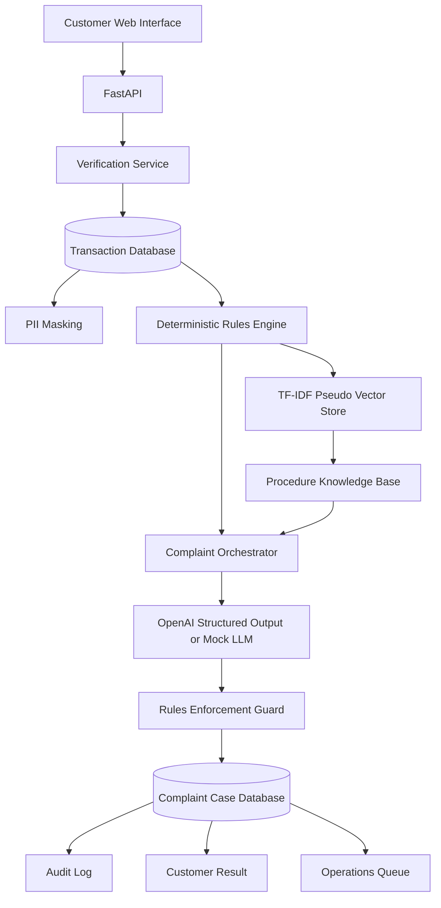

# MFS Complaint Copilot

> A secure, production-oriented chatbot web application for investigating mobile financial-service transaction complaints by reference number, providing safe initial guidance, creating an auditable complaint case, and routing unresolved problems to the correct operational team.

---

## Table of Contents

1. [Project Summary](#project-summary)
2. [Business Problem](#business-problem)
3. [Goals and Non-Goals](#goals-and-non-goals)
4. [Key Features](#key-features)
5. [Security Boundary](#security-boundary)
6. [Technology Stack](#technology-stack)
7. [High-Level Architecture](#high-level-architecture)
8. [End-to-End Request Flow](#end-to-end-request-flow)
9. [Core Building Blocks](#core-building-blocks)
10. [Pseudo Vector Database](#pseudo-vector-database)
11. [OpenAI Integration](#openai-integration)
12. [Complaint Rules and Routing](#complaint-rules-and-routing)
13. [Database Design](#database-design)
14. [API Design](#api-design)
15. [Frontend Experience](#frontend-experience)
16. [Project Structure](#project-structure)
17. [File-by-File Explanation](#file-by-file-explanation)
18. [Installation on Windows](#installation-on-windows)
19. [Running with Docker](#running-with-docker)
20. [Demo Data](#demo-data)
21. [Testing](#testing)
22. [Configuration](#configuration)
23. [Troubleshooting](#troubleshooting)
24. [Production Hardening](#production-hardening)
25. [Evaluation Plan](#evaluation-plan)
26. [Deployment Roadmap](#deployment-roadmap)
27. [Portfolio and Interview Value](#portfolio-and-interview-value)
28. [Future Improvements](#future-improvements)

---

## Project Summary

`MFS Complaint Copilot` is a full-stack demonstration application for a mobile financial-service provider.

A customer enters:

- a unique transaction reference number;
- a demonstration verification code;
- a natural-language description of the complaint.

The application then:

1. verifies the customer;
2. retrieves the transaction from a relational database;
3. masks customer-identifying information;
4. applies deterministic transaction rules;
5. searches a local complaint-procedure knowledge base;
6. generates a structured summary and customer-friendly response;
7. enforces routing and safety decisions;
8. creates an auditable complaint case;
9. shows the case in an operations queue.

The language model is deliberately not the authority for financial decisions. It acts as a controlled explanation and summarization layer.

---

## Business Problem

MFS complaint teams frequently receive issues such as:

- the sender was debited but the transfer failed;
- a cross-MFS transfer remains pending;
- the transaction is marked complete but the receiver reports no credit;
- the transaction was reversed but the customer cannot see the returned balance;
- the customer sent funds to the wrong receiver;
- the customer denies authorizing the transaction;
- a fee or transferred amount appears incorrect.

A purely manual process creates several problems:

- long waiting times;
- inconsistent first responses;
- incorrect team routing;
- repeated collection of transaction details;
- weak auditability;
- accidental disclosure of sensitive customer information;
- duplicate transfers caused by poor guidance;
- lack of structured data for complaint analytics.

This application standardizes initial triage while preserving human control for sensitive or unresolved cases.

---

## Goals and Non-Goals

### Goals

The project demonstrates how to:

- search a transaction using a unique reference;
- verify the claimant before revealing transaction information;
- classify common transaction failures;
- provide safe initial responses;
- retrieve internal procedures with vector similarity;
- summarize a complaint into structured fields;
- route cases to operational teams;
- maintain complaint and audit records;
- provide a polished customer and operations interface;
- keep financial authority outside the LLM.

### Non-Goals

The demonstration does not:

- transfer money;
- reverse transactions;
- change wallet balances;
- execute arbitrary SQL generated by a model;
- access a real MFS network;
- provide production-grade identity verification;
- replace a licensed fraud or disputes team;
- promise recovery of funds;
- make regulatory or legal decisions.

---

## Key Features

### Verified Reference Lookup

The customer must provide the transaction reference and a demonstration verification code before transaction data is returned.

### Deterministic Complaint Classification

A Python rules engine checks transaction state, message content, transfer age, debit state, receiver-credit state, reversal state, and whether the transfer crosses MFS providers.

### Pseudo Vector Retrieval

A local TF-IDF index searches complaint procedures using cosine similarity.

### Structured OpenAI Output

When OpenAI mode is enabled, the Responses API parses output directly into the `ComplaintAssessment` Pydantic model.

### Safety Override

The rules engine's category, priority, route, and self-resolution decision overwrite any conflicting LLM output.

### Case Routing

Cases are routed to teams including:

- Customer Support;
- Auto-Reversal Operations;
- Switch Operations;
- Interoperability and Settlement;
- Recipient Wallet Operations;
- Fraud and Risk;
- Disputes and Chargeback;
- Finance Reconciliation.

### Audit Trail

Every complaint creates a `ComplaintCase` and an `AuditLog` record.

### Responsive User Interface

The frontend contains:

- demo transaction cards;
- conversational interaction;
- transaction snapshot;
- complaint assessment;
- priority badge;
- routing information;
- next steps;
- retrieved procedure evidence;
- operations queue;
- architecture visualization.

### Mock Mode

The entire application works without an API key when:

```env
MOCK_LLM=true
```

---

## Security Boundary

This is the most important design principle in the repository.

### Deterministic code controls

- customer verification;
- database lookup;
- transaction-state interpretation;
- complaint category;
- priority;
- team routing;
- whether the issue can receive immediate guidance;
- case creation;
- audit logging.

### The LLM may only

- summarize the complaint;
- phrase an initial response;
- organize next steps;
- cite retrieved procedure identifiers;
- improve clarity and tone.

### The LLM cannot

- execute a transfer;
- reverse or refund money;
- alter a database record;
- lower the priority of an unauthorized-transfer complaint;
- redirect a case away from the deterministic team;
- expose full phone numbers or names;
- request a PIN, password, or OTP;
- promise financial recovery.

This separation reduces hallucination and authorization risk.

---

## Technology Stack

### FastAPI

FastAPI provides:

- HTTP routing;
- request validation;
- response validation;
- dependency injection;
- automatic OpenAPI documentation;
- static-file serving;
- template rendering integration.

### Pydantic

Pydantic defines strict application contracts:

- `ComplaintRequest`;
- `TransactionPublic`;
- `RuleDecision`;
- `KnowledgeHit`;
- `ComplaintAssessment`;
- `ComplaintResult`;
- `CaseListItem`.

Pydantic prevents uncontrolled text from becoming application state.

### SQLAlchemy

SQLAlchemy provides object-relational mapping for:

- transactions;
- complaint cases;
- audit logs.

The demo uses SQLite, but the ORM makes migration to PostgreSQL easier.

### SQLite

SQLite stores demonstration data in one local file.

It is useful for:

- local development;
- portfolio demos;
- automated testing;
- zero-configuration setup.

It should be replaced by PostgreSQL or another approved database for production.

### OpenAI Responses API

The project uses:

```python
client.responses.parse(
    model=settings.openai_model,
    input=[...],
    text_format=ComplaintAssessment,
)
```

The default model is:

```env
OPENAI_MODEL=gpt-5.6-luna
```

This model is appropriate for a high-volume, cost-sensitive summarization workload. The flagship alias `gpt-5.6` or `gpt-5.6-terra` may be selected for stronger reasoning when business requirements justify the additional cost.

### scikit-learn

The pseudo vector store uses:

- `TfidfVectorizer`;
- sparse text vectors;
- `cosine_similarity`.

### Jinja2

Jinja2 renders the HTML application shell and inserts server configuration such as the model name and mock-mode status.

### Vanilla JavaScript

The browser code handles:

- API calls;
- demo selection;
- chat rendering;
- result rendering;
- operations-queue refresh;
- tab navigation;
- safe HTML escaping.

### CSS

The visual design uses:

- dark financial-technology styling;
- responsive layouts;
- glass-like cards;
- priority badges;
- mobile breakpoints;
- dashboard tables;
- architecture cards.

### Pytest

Tests cover:

- high-risk routing;
- reversal routing;
- vector retrieval;
- phone masking;
- name masking.

### Docker

Docker provides a repeatable deployment environment.

---

## High-Level Architecture



### Application Layers

```text
Presentation Layer
    HTML
    CSS
    JavaScript

API Layer
    FastAPI routers
    Pydantic request and response schemas

Orchestration Layer
    ComplaintOrchestrator

Domain Layer
    Rules engine
    Transaction verification
    Privacy masking

AI Layer
    Local vector retrieval
    OpenAI structured output
    Mock LLM mode

Persistence Layer
    SQLAlchemy
    SQLite

Quality Layer
    Pytest
    audit logs
    strict output schemas
```

---

## End-to-End Request Flow

### 1. Browser submission

The user submits:

```json
{
  "reference_number": "MFS202607120004",
  "verification_code": "3410",
  "message": "The amount was deducted, but the receiver has not received it."
}
```

### 2. Request validation

`ComplaintRequest` checks:

- reference length;
- verification-code length;
- complaint-message length.

### 3. Customer verification

`get_verified_transaction()` retrieves the transaction and compares the submitted demonstration code against the final four digits of the sender phone.

This is only a demonstration mechanism.

### 4. Transaction lookup

The service retrieves:

- reference;
- sender and receiver identifiers;
- MFS providers;
- amount and fee;
- transaction status;
- debit state;
- receiver-credit state;
- reversal state;
- failure code;
- timestamps.

### 5. Privacy masking

The frontend never receives raw names or full phone numbers.

Example:

```text
Amina Rahman → A**** R*****
+8801712344488 → *********4488
```

### 6. Rules evaluation

`evaluate_transaction()` assigns:

- complaint category;
- priority;
- routed team;
- self-resolvable flag;
- safe initial response;
- required operational actions;
- reason codes.

### 7. Retrieval query construction

The orchestrator combines:

- customer message;
- deterministic category;
- transaction status;
- same-MFS or cross-MFS signal;
- failure reason.

### 8. Procedure retrieval

The pseudo vector store returns the top procedure articles.

### 9. Structured LLM assessment

In OpenAI mode, the sanitized payload is passed to the model.

The model returns a `ComplaintAssessment`.

### 10. Safety enforcement

`_enforce_rules()` replaces these fields with deterministic values:

- category;
- priority;
- routed team;
- self-resolvable state.

It also removes citations that were not present in retrieved context.

### 11. Case creation

The application creates:

- a public complaint case ID;
- complaint category;
- priority;
- route;
- summary;
- response;
- next steps;
- citation list;
- status.

### 12. Audit event

An audit record stores the routing and classification event.

### 13. Response rendering

The frontend displays the masked transaction, response, route, evidence, and case status.

---

## Core Building Blocks

### `ComplaintOrchestrator`

This is the workflow coordinator.

It does not contain all business logic itself. Instead, it calls specialized services:

```text
Verification Service
Rules Engine
Vector Store
LLM Service
Persistence Layer
```

This separation improves testing and maintainability.

### `RuleDecision`

The rules engine returns a typed object rather than a loose dictionary.

```python
class RuleDecision(BaseModel):
    category: ComplaintCategory
    priority: Priority
    routed_team: str
    self_resolvable: bool
    safe_initial_response: str
    required_actions: list[str]
    reason_codes: list[str]
```

### `ComplaintAssessment`

The OpenAI or mock layer returns:

```python
class ComplaintAssessment(BaseModel):
    category: ComplaintCategory
    priority: Priority
    summary: str
    initial_response: str
    routed_team: str
    self_resolvable: bool
    next_steps: list[str]
    cited_article_ids: list[str]
    confidence: float
```

### Masked Transaction View

`TransactionPublic` contains only information safe for the demonstration response.

### Audit Log

The audit model records:

- event type;
- actor;
- case ID;
- serialized details;
- timestamp.

---

## Pseudo Vector Database

The application calls the component a pseudo vector database because it provides vector-style search without running a dedicated vector server.

### Indexing

Every article is converted to searchable text by joining:

- title;
- category;
- symptoms;
- resolution;
- routing keywords.

### Vectorization

```python
TfidfVectorizer(
    ngram_range=(1, 2),
    stop_words="english",
    lowercase=True,
    sublinear_tf=True,
)
```

The output is a sparse TF-IDF matrix.

### Querying

A complaint query is transformed by the same vectorizer.

Cosine similarity compares the query vector with every procedure vector.

### Ranking

The highest-scoring procedures are returned as `KnowledgeHit` objects.

### Metadata filter

When a deterministic category exists, retrieval prefers:

- the same category;
- general security procedures.

### Advantages

- free;
- fully local;
- no API calls;
- easy to understand;
- easy to test;
- sufficient for a small knowledge base.

### Limitations

- lexical rather than semantic understanding;
- no persistence layer for embeddings;
- no incremental indexing;
- limited multilingual capability;
- poor performance on large corpora;
- no distributed search.

### Production replacement

Potential options:

- PostgreSQL with pgvector;
- Qdrant;
- Milvus;
- Weaviate;
- Elasticsearch/OpenSearch vector search;
- an approved managed retrieval service.

---

## OpenAI Integration

### Model choice

The project defaults to:

```env
OPENAI_MODEL=gpt-5.6-luna
```

Use cases:

- high-volume complaint summaries;
- customer-response drafting;
- structured extraction;
- procedure-grounded explanation.

Alternative configuration:

```env
OPENAI_MODEL=gpt-5.6-terra
```

or:

```env
OPENAI_MODEL=gpt-5.6
```

### Structured outputs

The SDK receives a Pydantic class through `text_format`.

Benefits:

- predictable field names;
- validation;
- no manual JSON extraction;
- easier testing;
- easier downstream processing.

### Sanitized payload

The LLM receives no raw customer names or full phone numbers.

### Prompt rules

The system prompt explicitly prohibits:

- requesting secrets;
- inventing transaction fields;
- promising recovery;
- changing deterministic routing;
- recommending duplicate transfers;
- claiming unconfirmed credits or reversals.

### Mock mode

Mock mode uses exactly the same `ComplaintAssessment` schema.

This means the application architecture remains stable when OpenAI mode is enabled.

---

## Complaint Rules and Routing

### Unauthorized transfer

```text
Category: unauthorized_transfer
Priority: urgent
Team: Fraud and Risk
Self-resolvable: no
```

### Failed but sender debited

```text
Category: failed_debited
Priority: high
Team: Auto-Reversal Operations
Self-resolvable: no
```

### Confirmed reversal

```text
Category: reversed_transfer
Priority: low
Team: Customer Support
Self-resolvable: yes
```

### Pending inside normal window

```text
Category: pending_transfer
Priority: low
Team: Customer Support
Self-resolvable: yes
```

### Pending beyond SLA

Same-MFS:

```text
Team: Switch Operations
```

Cross-MFS:

```text
Team: Interoperability and Settlement
```

### Completed but receiver not credited

Same-MFS:

```text
Team: Recipient Wallet Operations
```

Cross-MFS:

```text
Team: Interoperability and Settlement
```

### Wrong receiver

```text
Team: Disputes and Chargeback
```

### Fee or amount dispute

```text
Team: Finance Reconciliation
```

---

## Database Design

### Transaction

Stores the transaction-of-record data used for complaint investigation.

Important fields:

- `reference_number`;
- sender and receiver identifiers;
- sender and receiver names and phones;
- source and target MFS;
- amount;
- fee;
- currency;
- status;
- sender-debited flag;
- receiver-credited flag;
- reversal flag;
- failure code and reason;
- initiation and completion times.

### ComplaintCase

Stores:

- public case ID;
- transaction relationship;
- original customer message;
- classification;
- priority;
- team;
- summary;
- response;
- next steps;
- citations;
- status;
- self-resolution flag;
- timestamps.

### AuditLog

Stores significant workflow events.

### Relationships

```text
Transaction 1 ─────── * ComplaintCase
ComplaintCase 1 ───── * AuditLog
```

---

## API Design

### Health check

```http
GET /api/health
```

### Demo references

```http
GET /api/demo-references
```

### Analyze complaint

```http
POST /api/complaints/analyze
Content-Type: application/json
```

Example request:

```json
{
  "reference_number": "MFS202607120005",
  "verification_code": "8824",
  "message": "The transaction is completed but the receiver has not received the money."
}
```

### List cases

```http
GET /api/cases
```

### OpenAPI documentation

```text
http://127.0.0.1:8000/docs
```

---

## Frontend Experience

The interface is designed to look like a modern fintech support product.

### Customer Assistant tab

Contains:

- demo scenarios;
- chat-style interaction;
- reference and verification fields;
- complaint description;
- structured result panel.

### Operations Queue tab

Shows:

- total cases;
- open cases;
- urgent cases;
- bot-guidance resolutions;
- case table.

### How It Works tab

Explains:

```text
Verify → Lookup → Decide → Retrieve → Explain → Route
```

### Browser safety

Dynamic content is HTML-escaped before rendering.

---

## Project Structure

```text
mfs_complaint_copilot_full/
├── .env.example
├── .gitignore
├── Dockerfile
├── docker-compose.yml
├── pyproject.toml
├── requirements.txt
├── README.md
├── app/
│   ├── __init__.py
│   ├── config.py
│   ├── database.py
│   ├── main.py
│   ├── models.py
│   ├── schemas.py
│   ├── seed.py
│   ├── routers/
│   │   ├── __init__.py
│   │   └── api.py
│   ├── services/
│   │   ├── __init__.py
│   │   ├── complaint_orchestrator.py
│   │   ├── llm_service.py
│   │   ├── masking.py
│   │   ├── rules_engine.py
│   │   ├── transaction_service.py
│   │   └── vector_store.py
│   ├── static/
│   │   ├── app.js
│   │   └── styles.css
│   └── templates/
│       └── index.html
├── data/
│   └── knowledge_base.json
└── tests/
    ├── test_masking.py
    ├── test_rules_engine.py
    └── test_vector_store.py
```

---

## File-by-File Explanation

### `.env.example`

Documents configurable values without exposing secrets.

### `requirements.txt`

Supports traditional pip installation.

### `pyproject.toml`

Defines package metadata and dependency ranges.

### `Dockerfile`

Builds a Python 3.12 application container.

### `docker-compose.yml`

Runs the container and persists the SQLite file.

### `app/config.py`

Loads environment variables using `pydantic-settings`.

### `app/database.py`

Creates the SQLAlchemy engine, session factory, and FastAPI database dependency.

### `app/models.py`

Defines ORM entities.

### `app/schemas.py`

Defines all input, output, domain, and AI contracts.

### `app/seed.py`

Creates demonstration transactions when the database is empty.

### `transaction_service.py`

Performs verified lookup, masking conversion, and sanitized LLM context creation.

### `rules_engine.py`

Contains deterministic complaint logic.

### `vector_store.py`

Indexes and searches procedure articles.

### `llm_service.py`

Implements mock and OpenAI structured-output modes.

### `complaint_orchestrator.py`

Coordinates the end-to-end workflow and persists cases.

### `routers/api.py`

Exposes the JSON API.

### `main.py`

Creates the FastAPI application and serves the web interface.

### `index.html`

Defines the application structure.

### `styles.css`

Defines the responsive visual system.

### `app.js`

Handles browser interaction and API integration.

### `knowledge_base.json`

Contains complaint procedures for retrieval.

### `tests/`

Contains automated checks for core deterministic behavior.

---

## Installation on Windows

### 1. Extract and enter the project

```powershell
cd mfs_complaint_copilot_full
```

### 2. Create a virtual environment

```powershell
python -m venv .venv
```

### 3. Activate it

```powershell
.\.venv\Scripts\Activate.ps1
```

When execution policy blocks activation:

```powershell
Set-ExecutionPolicy -Scope Process -ExecutionPolicy Bypass
.\.venv\Scripts\Activate.ps1
```

### 4. Install dependencies

```powershell
python -m pip install --upgrade pip
pip install -r requirements.txt
```

### 5. Create `.env`

```powershell
Copy-Item .env.example .env
```

### 6. Run in free mock mode

Keep:

```env
MOCK_LLM=true
```

Then run:

```powershell
uvicorn app.main:app --reload
```

### 7. Open the application

```text
http://127.0.0.1:8000
```

### 8. Enable OpenAI mode

Edit `.env`:

```env
MOCK_LLM=false
OPENAI_API_KEY=your_real_api_key
OPENAI_MODEL=gpt-5.6-luna
```

Restart Uvicorn.

---

## Running with Docker

Create `.env` first:

```powershell
Copy-Item .env.example .env
```

Run:

```powershell
docker compose up --build
```

Stop:

```powershell
docker compose down
```

---

## Demo Data

| Reference | Code | Scenario |
|---|---:|---|
| `MFS202607120001` | `4488` | Completed same-MFS transfer |
| `MFS202607120002` | `7712` | Failed, sender debited |
| `MFS202607120003` | `0091` | Confirmed reversal |
| `MFS202607120004` | `3410` | Long-pending cross-MFS transfer |
| `MFS202607120005` | `8824` | Completed cross-MFS, receiver not credited |
| `MFS202607120006` | `6620` | Suspected unauthorized transfer |

---

## Testing

Run:

```powershell
pytest
```

Tests currently verify:

- unauthorized complaints remain urgent;
- unauthorized complaints route to Fraud and Risk;
- failed/debited transactions route to Auto-Reversal Operations;
- confirmed reversals can receive immediate guidance;
- vector search returns the relevant reversal procedure;
- masking protects most personal data.

### Additional tests recommended

- API integration tests;
- database transaction rollback tests;
- invalid verification tests;
- citation allow-list tests;
- LLM rule-override tests;
- prompt-injection tests;
- concurrency tests;
- performance tests;
- browser end-to-end tests.

---

## Configuration

| Variable | Purpose | Default |
|---|---|---|
| `APP_NAME` | Display and API name | `MFS Complaint Copilot` |
| `DATABASE_URL` | SQLAlchemy connection string | SQLite |
| `MOCK_LLM` | Disable paid model calls | `true` |
| `OPENAI_API_KEY` | OpenAI credential | empty |
| `OPENAI_MODEL` | Structured-output model | `gpt-5.6-luna` |
| `MAX_KB_RESULTS` | Retrieved procedure count | `3` |

---

## Troubleshooting

### `ModuleNotFoundError`

Activate the environment and reinstall:

```powershell
.\.venv\Scripts\Activate.ps1
pip install -r requirements.txt
```

### OpenAI authentication error

Check:

- `MOCK_LLM=false`;
- key is present;
- no extra spaces exist around `=`;
- the key is active;
- the selected model is available to the project.

### Database appears stale

Delete the local demonstration database and restart:

```powershell
Remove-Item .\mfs_copilot.db
uvicorn app.main:app --reload
```

### Port already in use

```powershell
uvicorn app.main:app --reload --port 8001
```

### CSS is not loading

Ensure the application is started from the repository root.

### Vector search returns weak results

Improve:

- article symptom phrases;
- category labels;
- query construction;
- knowledge-base coverage.

For a larger system, migrate to dense embeddings and a real vector database.

---

## Production Hardening

A real financial deployment requires significantly more controls.

### Identity and access

- OAuth2/OIDC;
- authenticated customer sessions;
- OTP or another strong factor;
- RBAC for operations staff;
- least-privilege service identities;
- short-lived tokens.

### Data security

- TLS everywhere;
- database encryption;
- field-level encryption;
- managed secrets;
- private networking;
- key rotation;
- encrypted backups.

### API security

- gateway;
- WAF;
- rate limiting;
- schema limits;
- bot protection;
- request IDs;
- replay protection;
- service-to-service authentication.

### AI security

- prompt-injection defenses;
- strict context allow-list;
- PII redaction;
- model-output validation;
- citation verification;
- refusal handling;
- prompt versioning;
- evaluation gates;
- model fallback policy.

### Financial controls

- no model-authorized balance changes;
- maker-checker approval;
- idempotency keys;
- double-entry ledger reconciliation;
- event-sourced audit trail;
- human approval for reversals;
- transaction limits;
- fraud monitoring.

### Operations

- immutable centralized logs;
- metrics and tracing;
- alerting;
- incident response;
- disaster recovery;
- high availability;
- SLA timers;
- case ownership;
- regulator-approved retention.

---

## Evaluation Plan

### Classification metrics

- category accuracy;
- route accuracy;
- urgent-case recall;
- false self-resolution rate.

The false self-resolution rate is especially important because unresolved financial complaints should not be incorrectly closed.

### Retrieval metrics

- Recall@K;
- Precision@K;
- Mean Reciprocal Rank;
- article citation accuracy.

### Response-quality metrics

- factual grounding;
- policy compliance;
- tone;
- clarity;
- completeness;
- absence of prohibited promises.

### Operational metrics

- average triage time;
- P95 latency;
- case-routing time;
- complaint reopen rate;
- human correction rate;
- token cost per complaint.

### Security metrics

- PII leakage rate;
- prompt-injection success rate;
- unauthorized-access attempts;
- audit completeness.

---

## Deployment Roadmap

### Phase 1: Demonstration

- SQLite;
- TF-IDF retrieval;
- mock authentication;
- local UI;
- mock or OpenAI output.

### Phase 2: Internal pilot

- PostgreSQL;
- employee SSO;
- test CRM integration;
- real procedure documents;
- evaluation dashboard;
- centralized logs.

### Phase 3: Controlled customer pilot

- real customer authentication;
- API gateway;
- regulator-approved procedures;
- case-management integration;
- model monitoring;
- human escalation.

### Phase 4: Production

- high availability;
- full observability;
- disaster recovery;
- strict change management;
- security review;
- compliance approval;
- ongoing red-team and evaluation programme.

---

## Portfolio and Interview Value

This project demonstrates:

- FastAPI backend development;
- SQLAlchemy database modelling;
- Pydantic contracts;
- secure AI architecture;
- deterministic plus probabilistic system design;
- RAG-style retrieval;
- OpenAI Structured Outputs;
- privacy masking;
- audit logging;
- complaint routing;
- responsive frontend design;
- Docker packaging;
- automated testing.

### Résumé bullet

> Built a secure MFS complaint-resolution copilot using FastAPI, SQLAlchemy, Pydantic, OpenAI Structured Outputs, deterministic transaction rules, local vector retrieval, automated team routing, auditable case creation, and a responsive operations dashboard.

### Interview explanation

> I designed the system so the LLM is not the authority over money or routing. The backend first verifies the customer and retrieves the transaction. A deterministic rules engine classifies the complaint and sets priority and ownership. A local vector store retrieves relevant operating procedures. The OpenAI model receives only sanitized data and returns a Pydantic assessment. The application then overwrites routing-sensitive fields with deterministic values, creates a complaint case, and records an audit event. This combines AI flexibility with financial-system controls.

---

## Future Improvements

- Bengali and Banglish complaint understanding;
- multilingual procedure retrieval;
- dense embeddings;
- pgvector or Qdrant;
- CRM integration;
- email/SMS status notifications;
- SLA countdowns;
- staff assignment;
- case comments;
- supervisor approvals;
- human feedback collection;
- Langfuse or OpenTelemetry tracing;
- model-cost dashboard;
- fraud-device signals;
- duplicate complaint detection;
- semantic caching;
- background workers;
- event-bus integration;
- PostgreSQL migration;
- Kubernetes deployment;
- GitHub Actions CI/CD.

---

## Final Engineering Principle

> Use the LLM for language and interpretation. Use deterministic services for identity, transaction truth, authorization, routing, and financial actions.

This principle is what transforms a chatbot demo into the beginning of a trustworthy financial-support system.
